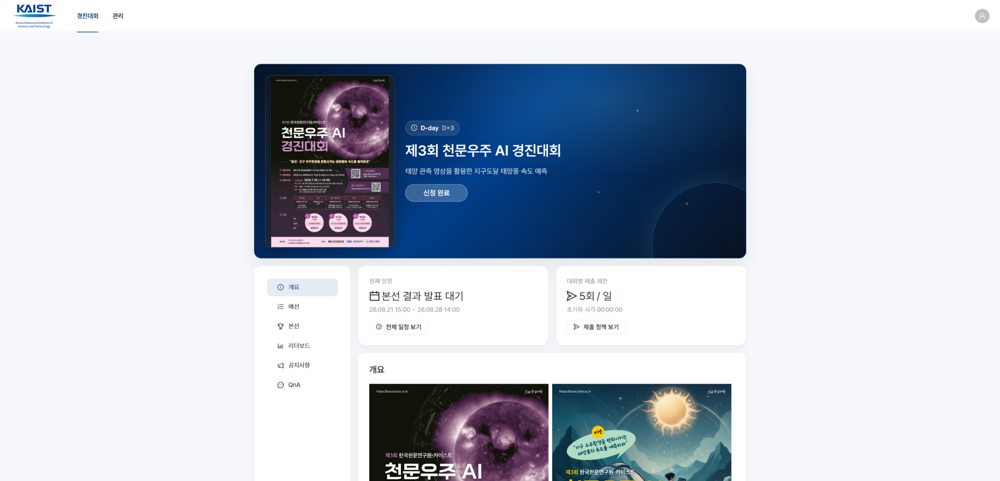
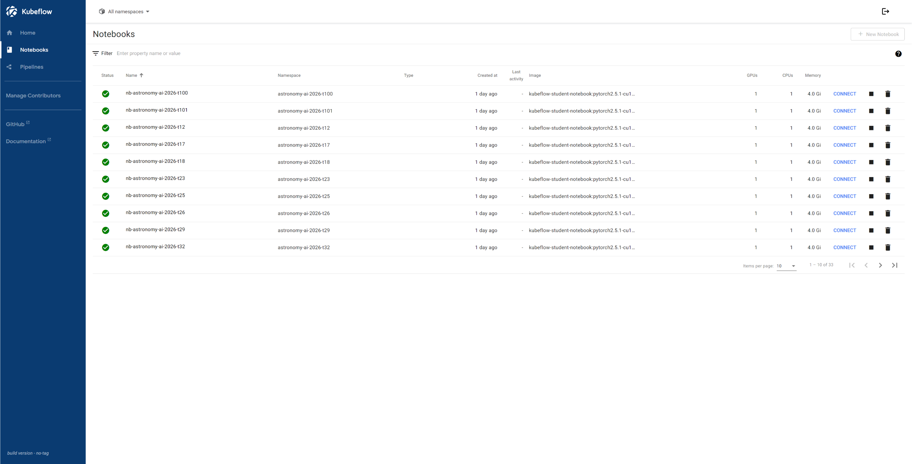
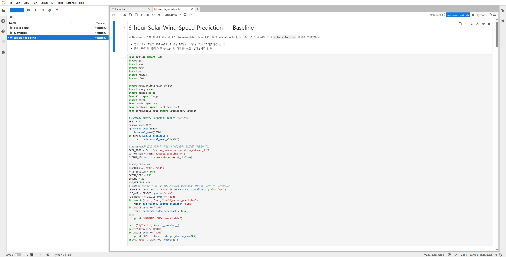
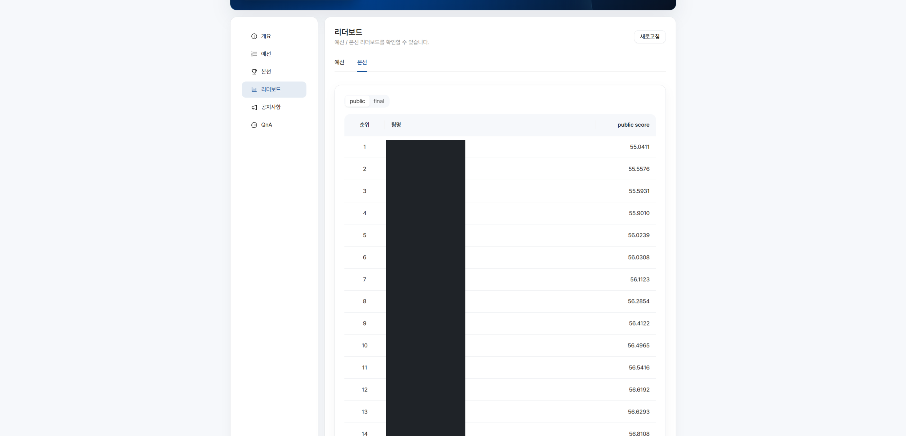
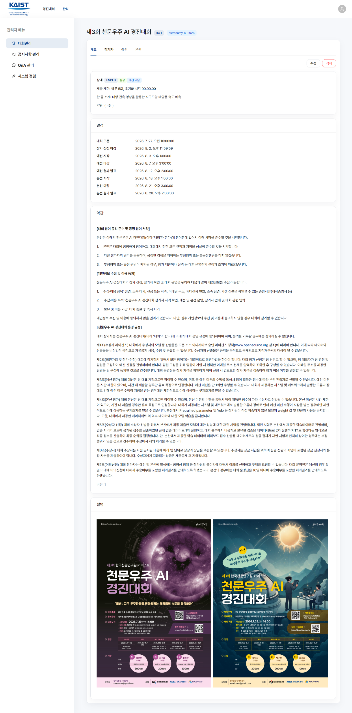
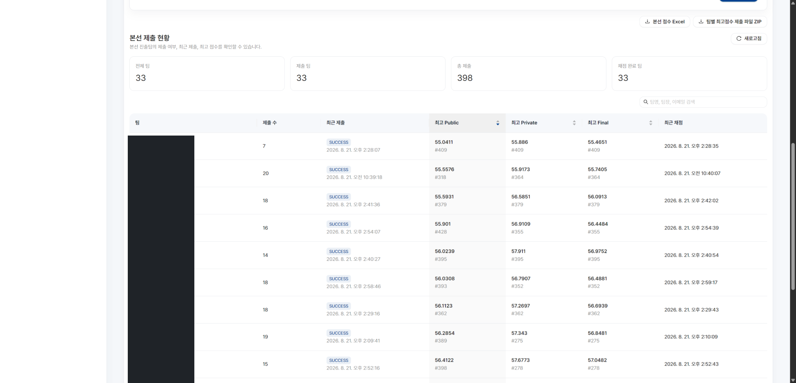

::: {.project-meta}
| | |
|---|---|
| **Role** | Platform / Infrastructure Engineer |
| **Domain** | AI Competition Platform |
| **Period** | 2026 |
| **Stack** | Kubernetes · Kubeflow · Keycloak · FastAPI · MariaDB · Ant Design |
:::

## 1. Overview

A platform that lets AI competition participants go through the entire competition workflow through a web platform.

```text
Join competition
→ Create GPU Notebook
→ Use dataset
→ Train model
→ Submit results
→ Automatic scoring
→ Check leaderboard
```

- ~30 teams advanced to the final round
- One NVIDIA A100 40GB GPU allocated per team
- Kubernetes / Kubeflow Notebook-based per-team work environment
- Automated submission / scoring system

::: {.callout-note}
## My Role
- Designed and provisioned per-team infrastructure manifests (Kubeflow Profile / Notebook / PV / PVC)
- Built a Python (Jinja2)-based pipeline to auto-generate manifests
- Operated Kubernetes Notebooks and handled incidents
- Supported Keycloak-based authentication integration
- Supported building the scoring infrastructure (Kubernetes Job-based)
- Set up and supported a separate GCP validation environment (model validation itself was handled by another team member)
:::

## 2. Platform UI

::: {#fig-dashboard}


Competition Dashboard — the participant's main screen, showing the competition overview, schedule, and submission policy at a glance
:::

Notebook creation requests are passed from the backend to Kubernetes, where the Kubeflow Notebook Controller creates a Notebook Pod for each team.

::: {#fig-notebooks}


Kubeflow Notebooks list — each team has a Notebook Pod running in an isolated namespace, with GPU/CPU/Memory allocations shown
:::

::: {#fig-notebook-code}


Baseline code provided to participants — covers everything from data loading to generating the submission file inside JupyterLab
:::

::: {#fig-leaderboard-public}


Leaderboard (Public) — live rankings shown during the final round (team names masked)
:::

::: {#fig-leaderboard-final}


Leaderboard (Final) — final rankings with Public/Private/Final scores revealed after the competition ends (team names masked)
:::

::: {#fig-admin}


Admin — competition management screen, where admins configure the schedule, submission limits, and participation terms
:::

::: {#fig-admin-submissions}


Admin — final-round submission status. Shows each team's submission count, most recent submission time, and best Public/Private/Final scores at a glance (team names masked)
:::

The admin UI was built with Ant Design and Tiptap, and lets admins manage the competition schedule and notices.

## 3. System Architecture

```{mermaid}
flowchart TD
    U[User] --> W[Web Application]
    W --> AUTH[Authentication]
    AUTH --> KC[Keycloak]
    W --> NB[Notebook Management]
    NB --> K8S[Kubernetes]
    K8S --> KF[Kubeflow Notebook]
    KF --> GPU[GPU Pod]
    W --> SUB[Submission]
    SUB --> SS[Submission Storage]
    SS --> SJ[Scoring Job]
    SJ --> DB[(Database)]
    DB --> LB[Leaderboard]
```

## 4. Kubernetes / Kubeflow

To give each team an isolated work environment, I created one Kubeflow **Profile** per team (namespace-level isolation + RBAC) and provisioned a **Notebook** and **PV/PVC** inside each.

- Built a pipeline that generates per-team Kubeflow Profile / Notebook / PersistentVolume / PersistentVolumeClaim manifests using Python and Jinja2 templates
- Standardized repetitive infrastructure provisioning across ~30 teams as code
- Connected per-team GPU / CPU / Memory resources and NFS-backed storage
- Managed Notebook Pod lifecycle and handled incidents during operation
- Provided Kubeflow Pipelines alongside Notebooks, while disabling other Kubeflow features to keep the operational scope narrow
- Limited GPU allocation to one per team (no MIG or other GPU-splitting), and designed the operational policy so teams had to stop their Notebook server before running a GPU-requiring pipeline step

## 5. Authentication — Keycloak

The authentication structure for accessing the competition web platform and Kubeflow Notebooks.

- Keycloak-based user authentication
- Platform ↔ Keycloak integration
- Per-team Notebook access control

::: {.callout-note}
[TODO: fill in further detail once the OAuth/OIDC implementation specifics are confirmed]
:::

## 6. Submission & Scoring System

```{mermaid}
flowchart TD
    P[Participant] --> UP[Submission Upload]
    UP --> V[Validation]
    V --> ST[Storage]
    ST --> SJ[Kubernetes Scoring Job]
    SJ --> PUB[Public Score]
    SJ --> PRIV[Private Score]
    PUB --> DB[(MariaDB)]
    PRIV --> DB
    DB --> LB[Leaderboard]
```

### Submission Handling

- Managed submission artifacts: `submission.csv`, `code.ipynb`, model files
- File size limits and submission-count management
- CSV format validation

### Duplicate Detection

Applied a hash-based check to prevent duplicate submissions of the same submission CSV.

```text
submission.csv
      ↓
SHA-256
      ↓
Compare against existing submission hashes
      ↓
Duplicate / New submission
```

### Scoring Job

Ran an isolated Kubernetes Job for each submission to perform scoring.

- A separate Kubernetes Job runs for every submission
- Compares results against a hidden ground truth
- Computes Public / Private scores
- The scoring code checks out a specific tag/commit from a separately version-controlled repository before running
- **The hidden ground truth is mounted read-only and is never mounted into participant (student) namespaces** — scoring runs in a namespace isolated from participants' own work environment
- Results are stored in the database and reflected on the leaderboard

::: {.callout-note}
[TODO: only disclose the specific scoring algorithm or competition data to the extent it can be made public]
:::

## 7. Validation Infrastructure

::: {.callout-important}
## Important — Division of Responsibility
Model validation itself (reproducibility checks, ruling on submission rule violations, model performance validation) was handled by another team member. What I was responsible for was **setting up a separate GCP-based validation environment and supporting the infrastructure** so that person could carry out validation independently.
:::

### My Responsibility

- Set up a separate GCP validation environment
- Provided a Kubernetes / Kubeflow Notebook environment for the validation lead
- Configured access to datasets / submissions
- Connected the necessary storage / volumes
- Provisioned Notebook Pods
- Handled infrastructure issues that arose in the validation environment

```text
Competition Environment
       │
       │ dataset / submissions
       ▼
Separate GCP Validation Environment
       │
       ▼
Kubernetes / Kubeflow
       │
       ▼
Validation Notebook
       │
       ▼
Validator
```

## 8. Production Troubleshooting

### Incident — DiskPressure

**Problem.** During operation, some teams generated or compressed large files inside their Notebook environment, causing node storage usage to spike. Kubernetes entered a DiskPressure state and began evicting Notebook Pods.

**Investigation.**

```bash
kubectl describe node
kubectl describe pod
df -h
du -sh
```

Checked ephemeral storage usage on the node and located the large files.

**Root Cause.** Large files/compressed archives in a user's workspace exceeded the ephemeral storage threshold.

**Resolution.** Cleaned up the offending workspace and recovered the affected Notebook Pods.

::: {.callout-tip}
## Lesson Learned
In multi-tenant Notebook operations, managing ephemeral storage matters just as much as GPU/CPU/RAM, and user workload environments need a disk usage policy.
:::

### Incident — MariaDB Connection Exhaustion

```text
HTTP 502
→ Backend failure
→ Check DB connections
→ MariaDB max_connections issue
```

Starting from an HTTP 502 during a backend outage, I checked the DB connection state and identified and resolved a MariaDB `max_connections` issue.

### Incident — Large Model Upload

Identified a reverse-proxy buffering/request-handling issue during large model file uploads, and resolved it by adjusting the actual applied settings (Nginx `proxy_request_buffering`, upload size, timeout, etc.).

### Incident — Notebook OOM

Investigated Pod/Kernel abnormalities caused by spikes in Notebook memory usage and addressed them by adjusting resource limits.

::: {.callout-note}
[TODO: add any real Pod Scheduling / Provisioning incidents, if they occurred]
:::

## 9. What I Learned

- Experience operating multi-user GPU workloads
- Hands-on understanding of the Kubernetes workload lifecycle
- Experience operating Kubeflow Notebooks
- The importance of storage and resource isolation
- Real user workloads create resource patterns you don't expect
- Operational policy and observability matter just as much as building the service itself
