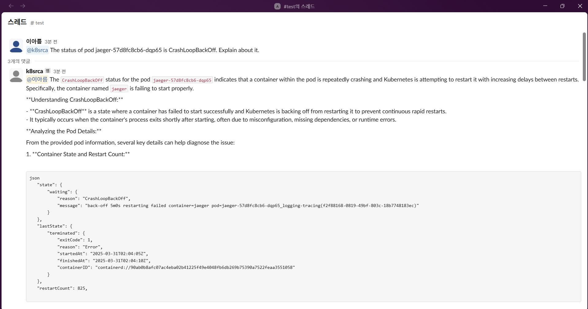
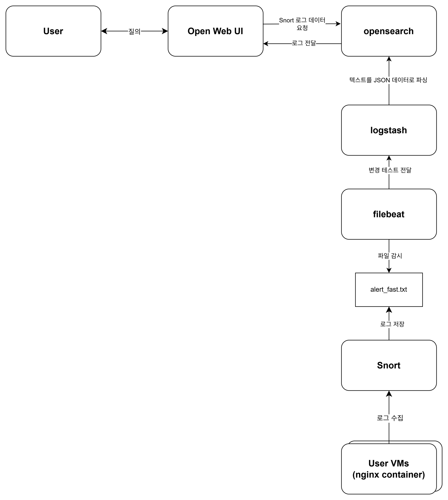
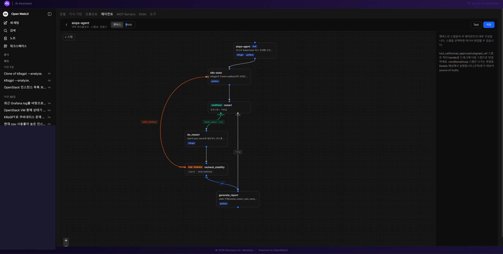

::: {.project-meta}
| | |
|---|---|
| **Role** | Platform / Infrastructure Engineer |
| **Domain** | LLM Agent-based AIOps |
| **Period** | 2024 – 2026 (ongoing) |
| **Stack** | LangGraph · OpenWebUI · MCP (K8sGPT · Grafana · OpenSearch) · Keycloak · FastAPI · Slack · Snort · Logstash |
:::

## 1. Overview

An AIOps system that connects infrastructure operations experience with an LLM-based interface, letting operators query infrastructure state and get support for operational tasks in natural language. This wasn't a one-off project — it **evolved across three stages**.

```text
Slack-based single tool-calling bot (2024)
        ↓
RAG + OpenWebUI integration for security event analysis (2025)
        ↓
LangGraph-based multi-agent + multi-MCP-server integration (2026)
```

::: {.callout-note}
## My Role
- Developed and built a Slack-integrated K8s LLM bot (Azure Marketplace, 2024.03–2025.05)
- Integrated an in-house security-vulnerability RAG with OpenWebUI and deployed it alongside a Snort/Logstash-based log pipeline (2025.05–2025.10)
- Designed and implemented a LangGraph-based multi-agent architecture, integrated MCP servers (K8sGPT, Grafana, OpenSearch), built an MCP server management UI, developed a SQLite-based dynamic MCP registry, and applied OpenTelemetry/Jaeger tracing (2025– )
- Debugged and resolved infrastructure issues that came up at each stage
:::

## 2. Stage 1 — Slack-integrated K8s LLM Bot

Built a conversational bot that, when mentioned in Slack, calls the K8sGPT tool to analyze Pod status and answer in natural language.

**Example — diagnosing CrashLoopBackOff**

```text
User (Slack): @k8srca A specific Pod is in CrashLoopBackOff. Explain what's going on.
     ↓
Bot: Calls the K8sGPT tool to look up Pod status (waiting reason, lastState, restartCount, etc.)
     ↓
Bot: Answers with a root-cause diagnosis based on what CrashLoopBackOff means and the container's restart history
```

**Example — diagnosing ContainerCreating**

```text
User (Slack): A specific Pod is stuck in ContainerCreating — which node is it on, and why?
     ↓
Bot: Looks up which node the Pod is scheduled on, image pull status, and PersistentVolumeClaim binding
     ↓
Bot: Lists possible causes (image pulling, volume mounting, init container delays) and
     suggests next diagnostic steps such as running kubectl describe pod
```

::: {.callout-note}
[TODO: when adding screenshots, replace real node hostnames, internal IPs, and internal Docker registry addresses with generalized examples]
:::

::: {#fig-slack-bot}


Example of the Slack bot (k8srca) diagnosing a CrashLoopBackOff Pod via the K8sGPT tool
:::

## 3. Stage 2 — Security-Vulnerability RAG + OpenWebUI Integration

Extended the existing K8s-focused bot with a pipeline that lets security events detected in network traffic be queried and analyzed in natural language.

::: {#fig-security-rag-arch}


The security event analysis pipeline, from Snort-based traffic detection through to natural-language queries in OpenWebUI
:::

### Flow

1. **Traffic monitoring and log generation** — Snort captures packets on the network interface and writes text logs to `alert_fast.txt`
2. **Data transport and refinement** — Filebeat watches the log file and forwards it to Logstash, which uses a Grok filter to parse unstructured data (IP/Port/SID, etc.) into structured JSON and stores it in OpenSearch
3. **LLM analysis and decision-making** — When a user submits a natural-language query in OpenWebUI, the LLM converts it into an OpenSearch query tool call, executes it, and presents the returned results as a natural-language report

At this stage I put into practice the interaction pattern where OpenWebUI's LLM converts a natural-language query into a structured tool call and then explains the result back to the user — which became the foundation for the next stage's LangGraph-based multi-agent structure.

## 4. Stage 3 — LangGraph-based Multi-agent AIOps Platform (current)

Extended the original single-bot structure into a LangGraph-based multi-agent architecture and integrated multiple MCP servers (K8sGPT, Grafana, OpenSearch).

### Overall Architecture

```{mermaid}
flowchart TD
    U[User] --> OW[OpenWebUI]
    OW --> AUTH[Authentication]
    AUTH --> KC[Keycloak]
    OW --> BE[AIOps Backend]
    BE --> AG[LangGraph Agent]
    AG --> MCP1[MCP: K8sGPT]
    AG --> MCP2[MCP: Grafana]
    AG --> MCP3[MCP: OpenSearch]
```

### Keycloak Integration

- User authentication via OpenWebUI's integration with Keycloak
- Debugged backend authentication and the SSO logout flow

### OpenWebUI Integration

In this architecture, OpenWebUI **acts as both the MCP Host and the MCP Client at the same time**.

```text
User → OpenWebUI (MCP Host/Client) → Authentication → AIOps Backend → Agent → MCP Server (Tool) → Response
```

- Built a UI inside OpenWebUI for registering/managing MCP servers (K8sGPT, Grafana, OpenSearch)
- Designed two MCP integration patterns, Mode A and Mode B
- Implemented a SQLite-based dynamic MCP server registry with a FastAPI CRUD API

### Single Agent Flow

The structure of the actual LangGraph Agent graph I implemented is shown below (rooted at `aiops-agent`).

::: {#fig-agent-canvas}


The `aiops-agent` graph as seen in OpenWebUI's Agent workflow builder — the full flow from root through diagnosis, restart, stability recheck, and report generation (internal IPs in the left-hand chat list are masked)
:::

The diagram below illustrates the same graph.

```{mermaid}
flowchart TD
    ROOT["aiops-agent (root)<br/>tools: k8sgpt, grafana"] --> STATE["k8s-state<br/>Diagnoses CrashLoopBackOff status via K8sGPT<br/>tools: grafana"]
    STATE --> RESTART["restart (conditional)<br/>rule-based branching"]
    RESTART -->|needs_restart = true| DO["do_restart<br/>restarts the target Pod<br/>tools: k8sgpt"]
    RESTART -->|default| REPORT
    DO --> RECHECK["recheck_stability (loop, max×5)<br/>while stabilized"]
    RECHECK -->|repeat| STATE
    RECHECK -->|exit| REPORT["generate_report<br/>synthesizes the full state<br/>tools: grafana"]
```

- **agent state**: manages state fields shared across nodes, such as `needs_restart` and `pod_name`
- **tool selection**: applies per-agent tool filtering, exposing only the MCP tools (k8sgpt, grafana) each node needs
- **conditional / loop nodes**: combines a conditional node that decides, on a rule basis, whether a restart is needed, with a loop node that repeats up to 5 times until stabilized, to build an automated recovery flow
- **tool execution & result**: queries Pod status through the K8sGPT MCP and, if needed, restarts the Pod and rechecks stability
- **final response**: synthesizes the full state (whether a restart happened, the target Pod, etc.) into an investigation report

### Example Agent Request

```text
"Check the current status of the GPU nodes."
     ↓
Agent → Tool Selection → Infrastructure/Monitoring MCP (K8sGPT/Grafana) → Result → Agent Analysis → User Response
```

## 5. Challenges

- Debugged Keycloak / OpenWebUI authentication integration and the SSO logout flow
- Debugged a goroutine hang caused by a K8sGPT image versioning issue
- Resolved a DNS boundary issue between Docker and Kubernetes
- Migrated a SQLite schema
- Migrated the Grafana MCP transport from SSE to Streamable HTTP
- Managed agent state and designed conditional/loop nodes
- Implemented tool calling and per-agent tool filtering across multiple MCP servers

## 6. What I Learned

- Experience gradually evolving a Slack-based single tool-calling bot into a LangGraph-based multi-agent structure
- Experience designing an architecture where OpenWebUI serves as an MCP Host/Client
- Experience connecting a log pipeline (Snort → Filebeat → Logstash → OpenSearch) with LLM querying
- Experience designing a way to integrate multiple MCP servers into a manageable form (dynamic registry, management UI)
- How directly existing infrastructure operations knowledge translates into LLM Agent design
