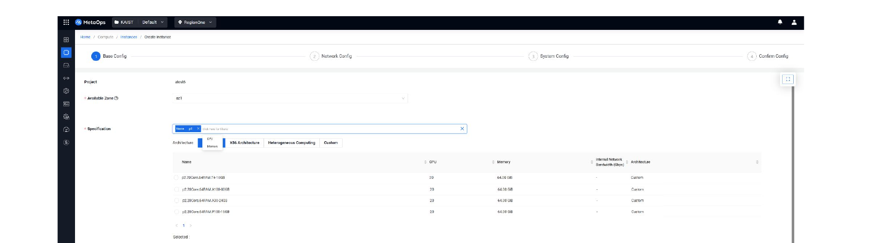
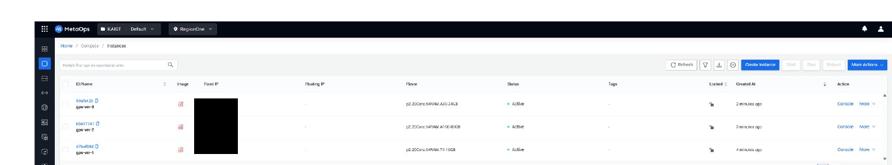
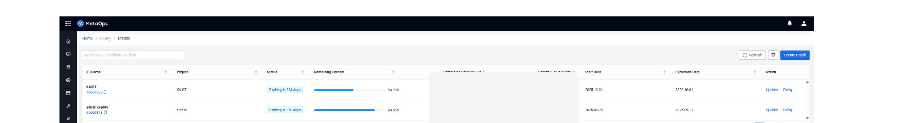
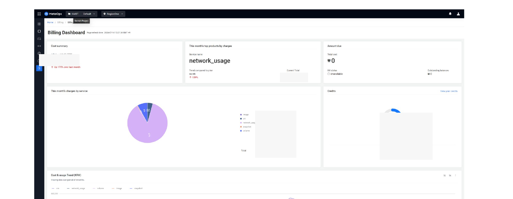

::: {.project-meta}
| | |
|---|---|
| **Role** | Platform / Infrastructure Engineer |
| **Domain** | Private Cloud Management Console |
| **Period** | 2023 – 2026 |
| **Stack** | OpenStack · CloudKitty · Heat · Prometheus · Ceilometer · Managed Grafana |
:::

## 1. Overview

A cloud management console that lets users manage OpenStack-based private cloud resources while giving operators control over them.

Key features:

- VM (Compute) management
- Volume / Storage management
- Network (Topology, routers, security groups, Floating IP)
- Orchestration (Heat-based Stacks)
- Resource request / admin approval
- Billing (CloudKitty integration)
- Monitoring (Prometheus / Ceilometer / Managed Grafana)

::: {.callout-note}
## My Role
I was involved in developing and operating this console across several stages over about three years.

- Developed the MetaOps Console **monitoring feature** (2023.12–2024.06): integrated metrics collected from Prometheus and Ceilometer into the in-house console
- **Enhanced** the MetaOps Console (2024.07–2024.11, for a financial-sector client): added Korean-language support to the console sign-up flow, integrated the billing feature with CloudKitty
- Developed the **resource request and allocation** feature (2024.12–2025.03, for a financial-sector client): built the UI/API for resource allocation/requests and deployed the related OpenStack components
- Added a **backup feature** to the MetaOps Console (2025.11–2026.01): added a resource backup feature using OpenStack Freezer
:::

## 2. Architecture

```{mermaid}
flowchart TD
    U[User] --> C[MetaOps Console]
    C --> B[Backend]
    B --> OS[OpenStack]
    OS --> COMP[Compute]
    OS --> STO[Storage]
    OS --> NET[Network]
    B --> CK[CloudKitty]
    B --> MON[Monitoring<br/>Prometheus / Ceilometer / Grafana]
```

## 3. OpenStack

The main OpenStack components and concepts handled through the console:

- **Nova** (Compute) — VM flavor selection, availability zones, instance lifecycle
- **Cinder** (Storage) — volume creation/attachment, snapshots
- **Neutron** (Network) — private networks, routers, security groups, Floating IP
- **Keystone** — authentication / projects / quotas
- **Heat** — Stack-based orchestration

The GPU VM creation flow actually offered by the console is structured as follows:

```text
Create private network
   ↓
Create router and connect to external network
   ↓
Create keypair
   ↓
Create security group and set rules
   ↓
Create VM instance (Base / Network / System Config)
   ↓
Allocate and attach Floating IP
   ↓
SSH in → verify NVIDIA driver
   ↓
Create and attach volume → format/mount
```

I designed each step so users could follow it in order through the console UI, and was responsible for the UI/API development and OpenStack component deployment this flow required.

::: {#fig-gpu-vm-create}


GPU VM creation — selecting a GPU flavor (A100/A30/T4/P100) and OS image in the Base Config step
:::

::: {#fig-gpu-vm-instances}


List of created GPU VM instances, with per-flavor status visible (Fixed IP masked)
:::

## 4. Resource Request / Approval

Rather than letting users create resources without limit, I designed and implemented a structure that manages cloud resources through a request-and-approval flow, built on **Adjutant** and **Mistral**.

### Architecture

MetaOps itself is deployed only in a single region (Region One) as the entry point for both users and admins, while Adjutant and Mistral are each deployed per-region so requests can be routed to and executed in whichever region the user selects.

```{mermaid}
flowchart TD
    U[User / Admin] --> MC["MetaOps Console (Region One only)"]
    MC --> RS[Select Region]
    RS --> AJ["Adjutant (per region)<br/>stores request info & status as a Task"]
    AJ --> MI["Mistral (per region)<br/>executes the request"]
    MI --> OS[OpenStack Resource Provisioning]
```

- **MetaOps** — the UI where users and admins submit and process resource requests
- **Adjutant** — stores the resource request's information and status using its Task feature
- **Mistral** — executes the resource request

### Scenario — Instance Creation Request

```{mermaid}
flowchart TD
    S1["User: open Resource Request menu → Create Resource Request"] --> S2["User: select 'Create Instance' type,<br/>set name / flavor / image → Confirm"]
    S2 --> S3["Admin: open Resource Request menu in the admin console → Update the Create Instance request"]
    S3 --> S4["Admin: select Network and Security Group → Approve"]
    S4 --> S5["If executed without error: status moves to Approved → Complete"]
```

### Scenario — Instance Deletion

```{mermaid}
flowchart TD
    D1["User: select the instance to delete in the Resource Request menu → create a deletion request"] --> D2["Admin: approve the instance deletion request in the Resource Request menu"]
    D2 --> D3["If executed without error: status moves to Approved → Complete"]
```

### Rejection & Error Handling

- Any request can be cancelled by an admin at any time
- If an error occurs while executing a request, the error detail is visible in the **Action Notes** section of the request's detail page
- Once the underlying cause is resolved, re-approving the request runs it again
- If the same request errors out again after being re-approved, it is automatically cancelled

## 5. Cloud Billing — CloudKitty

Integrated a CloudKitty-based cost calculation / billing structure into the console.

```{mermaid}
flowchart TD
    O[OpenStack Resource Usage] --> CK[CloudKitty]
    CK --> OS[(OpenSearch)]
    OS --> RU[Rated Usage]
    RU --> BA[Billing API]
    BA --> MC[MetaOps Console]
```

What this covers:

- Aggregating resource usage per user / per project
- Admin console features for prepaid credits: creation, top-up, deduction, expiry extension
- Detailed usage breakdown by Instance (GPU VM) / Volume
- The user console's Billing Dashboard (cost summary, per-service charges, usage trend charts)

CloudKitty uses OpenSearch as its underlying data store for rated usage records — see [Section 6](#opensearch) for how I used this directly to troubleshoot billing data issues.

::: {#fig-billing-credit-list}


Admin console — Credit list (create/top-up/deduct/extend expiry). Amounts masked
:::

::: {#fig-billing-dashboard}


User console — Billing Dashboard, showing the cost breakdown by service and usage trends. Amounts masked
:::

## 6. OpenSearch

In this project, OpenSearch served as **CloudKitty's data store** for rated usage records.

- CloudKitty writes its rated usage/billing records into OpenSearch as its backing store
- When billing data showed incorrect or inconsistent values, I queried OpenSearch directly and corrected the underlying records to fix the billing figures
- This was operational, ad-hoc data correction rather than a built console feature — a manual step I took when troubleshooting billing discrepancies

::: {.callout-tip}
## Troubleshooting — Incorrect Billing Values
**Problem.** Rated usage values shown in the Billing Dashboard occasionally didn't match actual resource usage.

**Investigation.** Queried CloudKitty's underlying OpenSearch index directly to inspect the raw rated-usage records behind the discrepancy.

**Resolution.** Corrected the affected records in OpenSearch so the billing figures reflected actual usage again.
:::

::: {.callout-note}
This is a separate use of OpenSearch from the AIOps project (Section 6), where OpenSearch stores parsed Snort security logs. Here, OpenSearch is CloudKitty's billing data store within MetaOps.
:::

## 7. Monitoring

- Integrated metrics collected from Prometheus and Ceilometer into the console to display VM/resource status
- Provided infrastructure monitoring dashboards via Managed Grafana

## 8. What I Learned

- Hands-on understanding of private cloud architecture and the OpenStack resource model
- The cloud resource lifecycle (request → approval → provisioning → usage → billing)
- Experience integrating a CloudKitty-based billing system
- Experience building a monitoring pipeline (Prometheus/Ceilometer/Grafana)
- Long-term experience operating a platform that evolved across multiple stages (monitoring → console improvements → resource management → backup)

