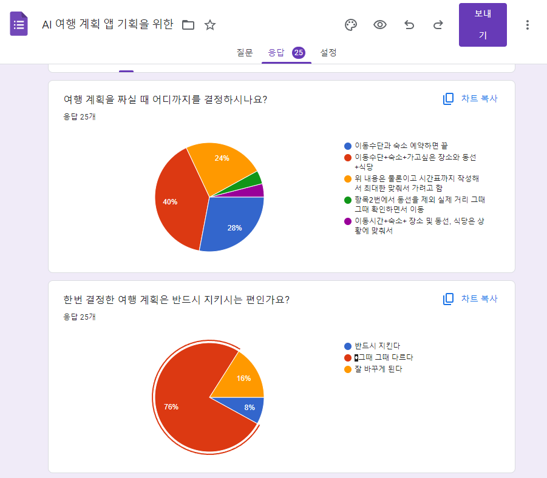
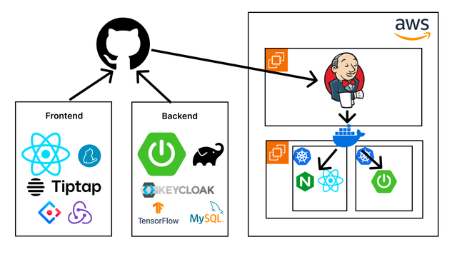

::: {.project-meta}
| | |
|---|---|
| **Role** | Team Lead · Planning, System Design, Frontend, Deployment |
| **Domain** | Travel planning / social platform |
| **Period** | 2024.07 – 2024.11 |
| **Context** | Capstone (graduation) project, B.Sc. Computer Engineering, Hongik University |
| **Stack** | React · Zustand · Sass · Spring Boot · Gradle · Jenkins · AWS (EC2 · S3 · RDS) |
:::

::: {#fig-logo}
{width=40%}

Tag A Trip logo
:::

## 1. Overview

Tag A Trip is a web platform for **planning a trip and sharing reviews afterwards**, all in one place. Users build a travel plan (places, route, schedule), plan together with friends, and after the trip turn that plan into a review others can browse.

::: {.callout-note}
## My Role
I led the team and was responsible for the project end to end.

- Ran overall planning: requirements gathering, scoping, and the schedule
- Led system design, applying the methods I had learned in Software Engineering coursework (user stories → screen design → sequence diagrams → API specification)
- Developed the frontend: shared layout, login, sign-up, friend requests, and the travel-plan creation UI
- Built the deployment pipeline on AWS with Jenkins — learning Gradle and Spring Boot builds from scratch to do it
:::

## 2. Requirements — Starting from a User Survey

Before designing features, we ran a short survey (25 responses) to understand how people actually plan trips.

::: {#fig-survey}


Requirements survey results (Google Forms, 25 responses; labels in Korean)
:::

**How far do you plan before a trip?**

| Answer | Share |
|---|---|
| Transport + accommodation + places to visit, route, and restaurants | 40% |
| Transport and accommodation only | 28% |
| All of the above, plus a detailed timetable | 24% |
| Other (places only, or restaurants decided on the spot) | ~8% |

**Once a plan is set, do you stick to it?**

| Answer | Share |
|---|---|
| It depends | 76% |
| I often change it | 16% |
| I always stick to it | 8% |

Two things stood out. About two-thirds of respondents plan down to the level of places and routes, so a plan needed to hold more than bookings. And **92% don't follow their plan strictly**, so plans had to be easy to edit — during the trip as well as before it.

## 3. Design Process

We documented the project in Confluence and Figma and produced a full set of design artifacts before writing code:

1. **User stories** to define the scope of the product
2. **Screen design** (wireframes and page flow) — [Figma: flow, mockups, and design](https://www.figma.com/design/zcwwirEeCrisekpSuiD95j/Flow?node-id=14-125&t=S4p7eEY8agLjLpfK-1)
3. **Sequence diagrams** to design how the frontend, API, and database interact for each feature
4. **RESTful API specification** derived from the sequence diagrams

Working in this order meant the frontend and backend could be developed in parallel against an agreed API contract.

## 4. Architecture & Deployment

::: {#fig-architecture}


Planned deployment architecture — GitHub → Jenkins on EC2 → Docker images for the React frontend (served by Nginx) and the Spring Boot backend
:::

- **Frontend**: React with Zustand for state management and Sass, plus UI/design libraries
- **Backend**: Spring Boot built with Gradle
- **Infrastructure**: AWS EC2 for the application and CI server, S3 for file storage, RDS for the database
- **CI/CD**: Jenkins pulls from GitHub, builds, and deploys to EC2

I had no prior Spring Boot experience, so to own deployment I learned the Gradle build process and wired it into the Jenkins pipeline myself.

::: {.callout-tip}
## Design Decision — Cutting Scope
The initial architecture (above) included Redux, Keycloak, and Kubernetes. As the project took shape we judged them **unnecessary for a project of this size** and dropped them: Zustand covered our state-management needs with far less boilerplate, and a single-node Docker deployment was enough for our traffic.
:::

## 5. Place Recommendation

The project included a Python module that recommends **types of places** (e.g. museums, beaches, cafés) based on the categories a user says they like. It uses **user-based collaborative filtering** over a public Google review-ratings dataset (average ratings per user across ~24 travel categories).

```text
User's liked categories
→ encode as a new "user" row (liked = 5, otherwise 0)
→ append to the ratings matrix, mean-centre each category
→ cosine similarity between the new user and every existing user
→ similarity-weighted average of ratings per category
→ top-N categories → mapped to app place categories
```

```python
rating_normalized = data.subtract(data.mean(axis=0)).fillna(0)

cosine_sim = cosine_similarity(rating_normalized)
user_similarity = pd.DataFrame(cosine_sim, index=data.index,
                               columns=data.index)["User 0"]

weighted = rating_normalized.T.dot(user_similarity)
scores = weighted / np.abs(user_similarity).sum()
top = scores.sort_values(ascending=False).head(num_recommendations)
```

### Looking back

Revisiting this as a Data Science student, there are several things I would now do differently:

- **Filter out what the user already chose.** The top-N can include categories the user selected, so a recommendation can just repeat their input.
- **Centre per user, not per category.** Subtracting category means corrects for popular categories, but not for users who rate everything high or low.
- **Handle the cold start explicitly.** Encoding preferences as 5/0 forces a sparse, binary profile into a matrix of continuous ratings; a content-based or popularity fallback would be more honest for new users.
- **Evaluate it.** There was no offline metric. A hold-out evaluation (e.g. precision@k on masked ratings) would show whether it beats simply recommending the most popular categories.

## 6. What I Learned

- Leading a team meant working across planning, design, frontend, and deployment rather than a single layer
- A structured design process (user stories → screens → sequence diagrams → API spec) makes parallel development possible
- Starting from user research gave us concrete reasons for our feature priorities
- Removing unnecessary technology is as important as adding it
- First hands-on experience taking a service all the way from code to a CI/CD pipeline on AWS
